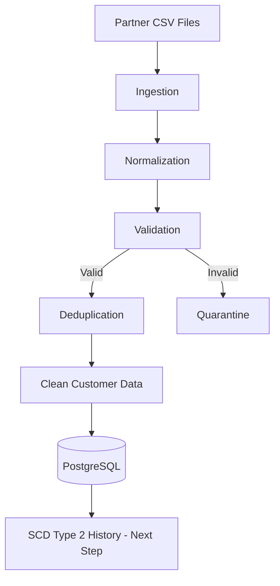

# Customer Data Merge Pipeline

A hands-on data engineering project that processes messy customer data from partner files and transforms it into clean, validated, and deduplicated customer records.

The project is being built to practice real-world data engineering concepts such as validation, quarantine workflows, deterministic deduplication, PostgreSQL, automated testing, and eventually Slowly Changing Dimension Type 2 (SCD Type 2) history tracking.

---

## Pipeline Architecture



---

## What I Have Built

### Data Ingestion

[`src/ingest.py`](src/ingest.py)

Loads raw partner CSV files using Pandas.

Incoming columns are initially treated as strings so important values are not accidentally modified.

For example:

```text
00701
```

must stay:

```text
00701
```

instead of becoming:

```text
701
```

This is important because ZIP codes are identifiers, not numbers used for calculations.

---

### Data Normalization

[`src/normalize.py`](src/normalize.py)

Normalizes customer information into a consistent format.

Current normalization includes:

```text
Whitespace removal
Name formatting
Lowercase email addresses
Preservation of string-based identifiers
```

The original DataFrame is copied before modification so the raw input remains unchanged.

---

### Data Validation

[`src/validate.py`](src/validate.py)

Checks customer records before allowing them to continue through the pipeline.

The validator currently detects problems such as:

```text
Invalid email addresses
Invalid monetary values
Missing customer IDs
```

Bad records are not silently deleted.

---

### Data Quarantine

Records that fail validation are separated from valid data.

Each rejected record receives a reason explaining why it failed.

Example:

```text
Customer 1005
Reason: Invalid email

Customer 1006
Reason: Invalid balance
```

This makes it possible to investigate bad records instead of simply losing them.

---

### Money Handling

The project uses Python's `Decimal` type when validating monetary values.

This avoids the precision problems that can occur when financial data is represented using floating-point numbers.

For example:

```python
Decimal("0.10") + Decimal("0.20")
```

produces an exact:

```text
0.30
```

---

### Deterministic Deduplication

[`src/deduplicate.py`](src/deduplicate.py)

Duplicate customer IDs are detected and removed using a predictable ordering.

The current sample dataset goes through this process:

```text
7 incoming rows
       |
       v
2 invalid rows quarantined
       |
       v
5 valid rows
       |
       v
1 duplicate removed
       |
       v
4 unique customers
```

The goal is for the same input to produce the same output each time the pipeline runs.

---

### Pipeline Controller

[`src/pipeline.py`](src/pipeline.py)

The pipeline controller connects the individual processing stages together.

Instead of manually running every step, the project can be executed with:

```powershell
python src/pipeline.py
```

Current flow:

```text
Ingest
  ↓
Normalize
  ↓
Validate
  ├── Invalid → Quarantine
  ↓
Valid
  ↓
Deduplicate
```

---

## Automated Testing

[`tests/test_dedup.py`](tests/test_dedup.py)

The project uses **pytest** for automated testing.

The current test verifies that duplicate customer IDs are correctly removed.

Run the tests with:

```powershell
pytest
```

Current result:

```text
1 passed
```

More tests will be added as the pipeline grows.

---

## PostgreSQL + Docker

[`docker-compose.yml`](docker-compose.yml)

PostgreSQL 17 runs inside a Docker container for the development database.

Start PostgreSQL with:

```powershell
docker compose up -d
```

Check the running containers with:

```powershell
docker ps
```

The database will eventually store the canonical customer table and complete customer history.

---

## Project Structure

```text
customer-data-pipeline/
│
├── data/
│   ├── incoming/
│   │   └── partner_a.csv
│   └── quarantine/
│
├── src/
│   ├── ingest.py
│   ├── normalize.py
│   ├── validate.py
│   ├── deduplicate.py
│   ├── merge.py
│   └── pipeline.py
│
├── tests/
│   ├── test_validation.py
│   ├── test_dedup.py
│   └── test_merge.py
│
├── sql/
│   └── schema.sql
│
├── docker-compose.yml
├── requirements.txt
├── .gitignore
└── README.md
```

---

## What I Learned

While building this project, I have practiced:

| Concept | What I Learned |
|---|---|
| Data ingestion | How to safely read raw partner files |
| Data types | Why identifiers such as ZIP codes should remain strings |
| Normalization | How to standardize inconsistent incoming data |
| Validation | How to detect bad records before database insertion |
| Quarantine | How to preserve rejected data with failure reasons |
| Decimal | Why money should not rely on normal floating-point arithmetic |
| Deduplication | How to make duplicate handling predictable |
| pytest | How automated tests protect pipeline behavior |
| Docker | How to run PostgreSQL without installing the database directly on Windows |
| Debugging | How to troubleshoot paths, imports, functions, and pipeline errors |

---

## Technologies

| Technology | Usage |
|---|---|
| Python | Pipeline development |
| Pandas | Data processing |
| PostgreSQL | Database |
| Docker | Database container |
| pytest | Automated testing |
| SQL | Database queries and modeling |
| Git | Version control |
| GitHub | Project hosting |

---

## Running the Project

Create a virtual environment:

```powershell
python -m venv .venv
```

Activate it:

```powershell
.venv\Scripts\Activate.ps1
```

Install dependencies:

```powershell
pip install -r requirements.txt
```

Start PostgreSQL:

```powershell
docker compose up -d
```

Run the pipeline:

```powershell
python src/pipeline.py
```

Run tests:

```powershell
pytest
```

---

## Project Progress

| Feature | Status |
|---|---|
| CSV ingestion | ✅ Complete |
| Data normalization | ✅ Complete |
| Data validation | ✅ Complete |
| Quarantine workflow | ✅ Complete |
| Deterministic deduplication | ✅ Complete |
| pytest setup | ✅ Complete |
| PostgreSQL Docker environment | ✅ Complete |
| PostgreSQL schema | 🔨 Next |
| Python → PostgreSQL integration | ⏳ Planned |
| SCD Type 2 history | ⏳ Planned |
| Idempotent batch processing | ⏳ Planned |
| Multiple partner formats | ⏳ Planned |
| Expanded automated tests | ⏳ Planned |

---

## Next Step

The next stage is designing the PostgreSQL customer schema and implementing **Slowly Changing Dimension Type 2 (SCD Type 2)**.

The goal will be to track changes such as:

```text
Mary Jones
Balance: $75
Effective: Jan 1 → Feb 10
```

followed by:

```text
Mary Jones
Balance: $100
Effective: Feb 10 → Current
```

while ensuring that running the same batch more than once does not create duplicate history.

---

## Why I Built This Project

I built this project to gain hands-on experience with the type of data ingestion, data quality, database, and pipeline problems that data engineers encounter in real systems.

Rather than only practicing individual Python exercises, this project combines multiple concepts into one working data pipeline.